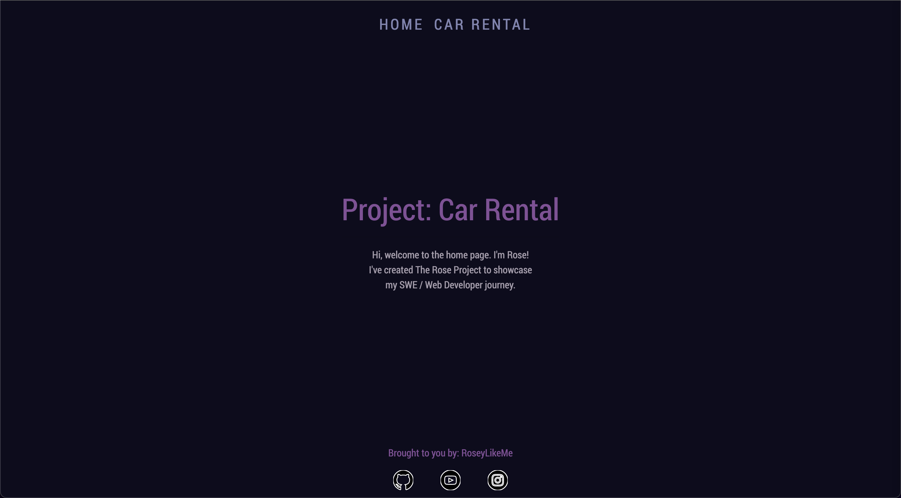
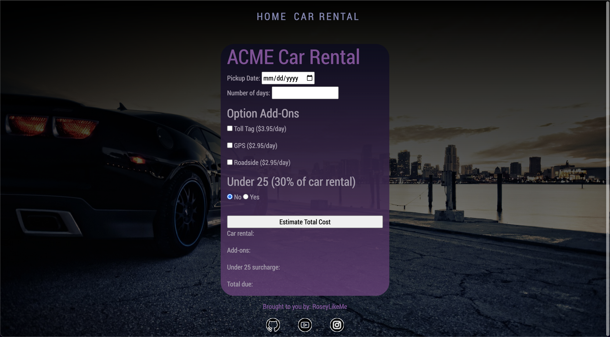

# Car Rental Project 🚗💨

Responsive javascript car rental project for YearUp & Pluralsight's
workbook 3. 

🌱 Utilized Bootstrap, CSS, HTML, and JS.

Check it out: https://roseylikeme.github.io/car-rental/

  
  

The Javascript portion was a headache, but i've learned several things:
- How to set minimum date field set to today, and have every date before it
  be disabled.
- How to set a minimum number for number field
- How to properly initialize variables and arrange where items are around 
  my JS page
- How to check for when a radio button or a checkbox is checked.
